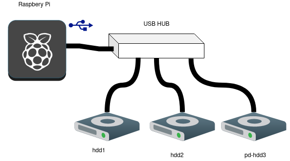

# peanuts

Light-weight raspbery pi nas

**This repo is still in development.** Feel free to contribute. See the [roadmap](ROADMAP.md) for what has been done and what is yet to be done.

## The idea

This project is inspired by the reddit posts [[1]](https://www.reddit.com/r/raspberry_pi/comments/d1hmop/made_a_raspberry_pi_4_nas_automated_download/)[[2]](https://www.reddit.com/r/raspberry_pi/comments/kdy806/my_pinas_is_growing/) by user [u/Albert_street](https://www.reddit.com/user/Albert_street) where a raspbery pi 4 is connected to a USB hub and many external drives are attached to the USB hub. The hub powers the drives, and the pi has relatively quick read/write via the USB3 ports. This repo aims create something similar using ansible scripts.



Behind the scenes, you have *mergerfs* to join all hard drives to work as one and *snapraid* to create a "raid" array.


## Installation


First off, lets start with a fresh install of raspian. I am going with raspian lite, which is headless. The raspbery pi website gives loads of instructions how to do this. I am using their "raspbery pi imager" for this job.


(optional) I am running my pi headless. To enable ssh access straight away, you need to create an empty file called ssh in the boot partition.


### (optional)Secure your Raspberry Pi

First things first secure your raspberry pi. You can use the ansible playbooks from [Securing-your-Raspberry-Pi-with-Ansible](https://github.com/tomgelbling/Securing-your-Raspberry-Pi-with-Ansible) repo. This repo automates the [offical security guidance](https://www.raspberrypi.org/documentation/configuration/security.md) which you can do manually if you like.


### Dependencies

Install ansible dependencies with

```
ansible-galaxy collection install ansible.posix
```


### Create vars.yml

Copy the example over so we can start populating it:

```
cp vars/vars.yml.example vars/vars.yml
```

This file has two sections. The first section contains the information on which drives to mount, and the second section contains information on which drives to join up using mergerfs.

We need to know the labels of the disks we want to mount. To do this, ssh onto your pi and run this to see the disks labels and fstype.

```
lsblk -o NAME,FSTYPE,SIZE,MOUNTPOINT,LABEL
```

Note that in the example, we name one drive with the prefix `pd-` for parity drive. Snapraid requires at least one parity drive and two data drives. In mergerfs, we merge only the data drives, not the parity one. Snapraid requires that the parity should be as large as the largest drive in the pool.

### Configure snapraid


```
cp files/snapraid.conf.example files/snapraid.conf
```

In this file, pick which disks you want it to be your parity and which ones you want it to be your content. I reccomend excluding some non-important folders. This can be at root level or for any subroot level. See snapraid documentation for more configuration options.


## Run ansible script

Create an inventory file with contents like this:

```
[pi]

<Your raspberry pis IP address>
```

The installation and setup of mergerfs and snapraid happen after running:

```
ansible-playbook -i inventory playbooks/main.yml --ask-become-pass
```

This will ask for the sudo password before it runs the scripts.

Currently, you still need to ssh into the system and run snapraid snyc manually. You probably want to set the sync to happen regularly via a cron job.


# Setting up samba

We use an existing role to do this for us. Run:

```
ansible-galaxy install bertvv.samba
```

Set up your configurations:

```
cp vars/samba.yml.example vars/samba.yml
```

Here you will specify the users and their passwords (this will be both their system and samba passwords), as well as the samba shares, and who can access which share. You can also create groups, but I will not do that here.

```
ansible-playbook -i inventory playbooks/samba.yml --ask-become-pass
```